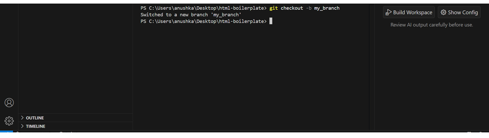

# How to Contribute to OSS Club: A Step-by-Step Guide for Beginners 

Welcome! This guide is for beginners who want to contribute to OSS club projects on GitHub.  
It explains *what contribution flow is, why it is important, and walks through the entire process in one flow*.


## What is Contribution Flow?

Contribution flow is the structured process for making changes to a repository safely and collaboratively.  

Why it matters:  
- Keeps the main branch stable  
- Allows changes to be reviewed and approved by maintainers  
- Supports collaboration without conflicts  
- Follows standard open-source practices

Think of it as a clear roadmap your changes follow from your computer to being included in the project.

## Prerequisites
Before you begin, make sure you have:
- A GitHub account
- Git installed on your computer
- VS Code (or any code editor)


## Contribution Process 

To contribute, you follow this flow:

1. *Fork the Repository* – 
Before you can make any changes, you need your own copy of  the original OSS Club repository.
This copy lets you experiment safely without affecting the main project.
On GitHub, this process is called *forking*.

   - Go to the OSS club GitHub repository and In the top-right corner, click the *Fork* button (it looks like a branch icon). 
       
     If the image does not preview, [view Here](https://raw.githubusercontent.com/anushka-star/oss-website/contribution-guidelines/contribution_guidelines/beginners/tutorial/images/s1.png )

   - GitHub will create a copy of that repository inside your own account.
      
     If the image does not preview, [view Here](https://raw.githubusercontent.com/anushka-star/oss-website/contribution-guidelines/contribution_guidelines/beginners/tutorial/images/s2.png )


2. *Clone the Forked Repository* – 
Cloning means downloading your *forked repository* (your copy of the project) from GitHub onto your local computer. This lets you make changes using VS Code. Once cloned, you’ll have a local folder containing all the files from the repository.  

 **Important Note:**
  Don’t clone the repository from the original owner’s account.
  Instead, always clone the forked repository from your own GitHub account.
  This way, you’ll have full permission to make changes, push updates, and later create a pull request to contribute back to the original project.
  
   1.*Open your fork on GitHub*
   - Go to your forked repository page on GitHub.  
   - Click the green *Code* button and copy the *HTTPS* link. (HTTPS is easier for beginners.)  
    
      
      If the image does not preview, [view Here](https://raw.githubusercontent.com/anushka-star/oss-website/contribution-guidelines/contribution_guidelines/beginners/tutorial/images/s3.png )


   2. *Open VS Code and its Terminal*
   - Open *VS Code* on your computer.  
   - Go to *View → Terminal* or press ``Ctrl+ `` to open the terminal at the bottom.
     
     If the image does not preview, [view Here](https://raw.githubusercontent.com/anushka-star/oss-website/contribution-guidelines/contribution_guidelines/beginners/tutorial/images/terminal.png )

   3. *Clone the repository*
   - In the terminal, type:
     ```bash
     git clone https://github.com/<your-username>/<repository-name>.git

   - This command downloads your forked repo into a local folder with the same name.
   - Once you’ve cloned your repository, Git automatically creates a new folder with the same name as your repo.  
     To start working inside it, you just need to move into that folder using the cd command.  

   - Run:
     ```bash
     cd <repository-name> 
     ```
     This makes sure all the upcoming Git commands are run in the correct project directory.
     

If the image does not preview, [view Here](https://raw.githubusercontent.com/anushka-star/oss-website/contribution-guidelines/contribution_guidelines/beginners/tutorial/images/s4.png )

   - Check files inside:
     ```bash
     ls    # macOS/Linux
     dir   # Windows

3. *Create a New Branch* – 
    Before making any changes, it’s always best to work on a *separate branch* instead of directly editing the main branch.  
    Branches help you keep your changes isolated and safe, so the main project stays stable while you experiment or contribute.
    - To create and switch to a new branch, use this command:
     ```bash
     git checkout -b <branch-name>
     ```
     
If the image does not preview, [view Here](https://raw.githubusercontent.com/anushka-star/oss-website/contribution-guidelines/contribution_guidelines/beginners/tutorial/images/s5.png )

4. *Create/Edit Files* – add your contribution.  
   - In this step, you edit existing files to add or improve content. For example, if you are working on index.html, you can add a paragraph, fix text, or update code. Editing files allows you to contribute without creating new files, which is common when improving documentation or website content.
   - Open the file in VS Code (index.html).
   - Make your changes, for example: adding a paragraph  

    **Before changes**-  
     
     If the image does not preview, [view Here](https://raw.githubusercontent.com/anushka-star/oss-website/contribution-guidelines/contribution_guidelines/beginners/tutorial/images/s6.png )  


    **After changes**-  
     
     If the image does not preview, [view Here](https://raw.githubusercontent.com/anushka-star/oss-website/contribution-guidelines/contribution_guidelines/beginners/tutorial/images/s7.png )

    After editing, you will stage and commit these changes in the next steps.


5. *Stage & Commit Changes* – 
    After editing or creating files in your branch, the next step is to *stage and commit your changes*. This saves your work in Git and prepares it to be pushed to GitHub.

   ### *1. Stage Your Changes*
   Staging tells Git *which files* you want to include in your next commit.  
  - Stage a single file:
  ```bash
  git add <file-name> 
  ```
  Stage all changes at once:
  ```bash
  git add .
   ```
  Why stage?  
  It allows you to choose exactly what goes into each commit.  
  Keeps commits clean and focused on a single change
 ### *2.Commit Your Changes*

A commit is like taking a snapshot of your work. Each commit should have a clear message describing your changes.
## Steps to make VS Code Your Default Git editor
Steps to Make VS Code Your Default Git Editor
 - Open your terminal (or Git Bash)  
You can use Git Bash, Command Prompt, or VS Code’s integrated terminal.  
 Run this command
 ```bash
git config --global core.editor "code --wait"
```
code → launches VS Code.
--wait → tells Git to pause and wait until you close VS Code before continuing (for example, during a commit or rebase).  

- Verify that it’s set correctly
Run:
```bash
git config --global core.editor
```
It should display
```bash
code --wait
```
Test it

Try running:
```bash
git commit
```
VS Code opens for you to enter the commit message.

## *When writing your commit message,follow these guidelines:*  

 - Give an observation on how the current system works in the
   present tense (so no need to say "Currently X is Y", or
   "Previously X was Y" to describe the state before your change;
   just "X is Y" is enough), and discuss what you perceive as a
   problem in it.

 - Propose a solution (optional---often, problem description
   trivially leads to an obvious solution in reader's minds).

 - Give commands to the codebase to "become like so".
```bash
git commit -s 
```
When committing changes, VS Code opens automatically because it is set as the default editor. A new tab appears where you can write your commit message following the guidelines. After typing the message, save the file (Ctrl+S on Windows/Linux or Cmd+S on Mac), then close the VS Code tab. Once the editor is closed, the commit is completed, and you can continue working with your repository or push the commit to the remote.  


If the image does not preview, [view Here](https://raw.githubusercontent.com/anushka-star/oss-website/contribution-guidelines/contribution_guidelines/beginners/tutorial/images/s8.png )

 

If the image does not preview, [view Here](https://raw.githubusercontent.com/anushka-star/oss-website/contribution-guidelines/contribution_guidelines/beginners/tutorial/images/s9.png )


## Tips for Commit Messages:
Write in present tense.
Observation describes the current state, not your change.
clearly mention the changes done.
Keep it concise but informative.

## Editing a Commit Message

- To edit your last commit message *before pushing*:
```bash
git commit --amend
```
6. *Push Branch to GitHub* – upload your branch to your fork.  
 -  After committing your changes locally, you need to push them to your GitHub       repository. Pushing uploads the changes from your local branch to the remote fork on GitHub. This step is essential so that your changes can be seen by maintainers and included in a Pull Request.

- When you push, your branch and its commits are safely stored on GitHub.

- Only pushed changes can be included in a Pull Request
   - Run:  
     ```bash
     git push origin <branch-name>
     ```
        
     If the image does not preview, [view Here](https://raw.githubusercontent.com/anushka-star/oss-website/contribution-guidelines/contribution_guidelines/beginners/tutorial/images/s13.png )

     
7. *Open a Pull Request (PR)* – submit changes for review.  
- A Pull Request (PR) is how you submit your changes for review so that maintainers can approve and merge them into the main project. When you push your branch to GitHub, the website will usually show a “Compare & pull request” button. Clicking this will open the PR page, where GitHub automatically shows the differences between your branch and the main branch.
     
If the image does not preview, [view Here](https://raw.githubusercontent.com/anushka-star/oss-website/contribution-guidelines/contribution_guidelines/beginners/tutorial/images/s10.png )

- On the PR page, you should give your Pull Request a clear title summarizing your changes, e.g., “Added a paragraph in index.html for postcode info”.
    
   If the image does not preview, [view Here](https://raw.githubusercontent.com/anushka-star/oss-website/contribution-guidelines/contribution_guidelines/beginners/tutorial/images/s11.png )


- Once done, click the Open Pull Request button to submit your PR for review.  
   
  If the image does not preview, [view Here](https://raw.githubusercontent.com/anushka-star/oss-website/contribution-guidelines/contribution_guidelines/beginners/tutorial/images/s12.png )


## Congratulations!
You’ve just made your first open-source contribution!  
Your changes are now part of the OSS Club project. Keep contributing and exploring more repositories — you’re officially an open-source contributor now!

## Step Recap (Brief)

- Fork → Clone → Create Branch → Create/Edit Files → Stage & Commit → Push → Open PR

1. Fork the Repository – Create your personal copy of the repo on GitHub so you can safely make changes.


2. Clone the Repository – Download your fork to your local machine to start working.


3. Create a Branch – Make a new branch for your changes to avoid affecting the main branch.


4. Edit Files – Update existing files (like index.html) or add content. Make meaningful changes.


5. Stage & Commit Changes – Stage your edited files and commit with a clear, descriptive message explaining your changes.


6. Push Branch to GitHub – Upload your branch and commits to GitHub so maintainers can see them.


7. Open a Pull Request (PR) – Click “Compare & pull request,” add a title and description, then submit for review.


8. Review & Respond – Maintainers may request changes. Update your branch and push fixes as needed.


9. Merge the PR – Once approved, your changes are merged into the main branch.


10. Celebrate Your Contribution – Your work is now part of the project. 

## Git commands used in the contribution flow 
```bash
git clone <repository-url>
cd <repository-name>
git checkout -b <branch-name>
git add <file-name>
git add .
git commit -s
git push origin <branch-name>
```

## Tips for Beginners
1. Write clear commit messages – Summarize changes concisely and meaningfully.


2. Always work in a branch – Never make changes directly on the main branch.


3. Pull latest changes regularly – Keep your branch up-to-date to avoid conflicts.


4. Push your branch frequently – Upload commits so changes are visible on GitHub.


5. Provide a clear PR title  – Explain what  you changed.


6. Follow repository guidelines – Stick to naming, formatting, and coding rules.
